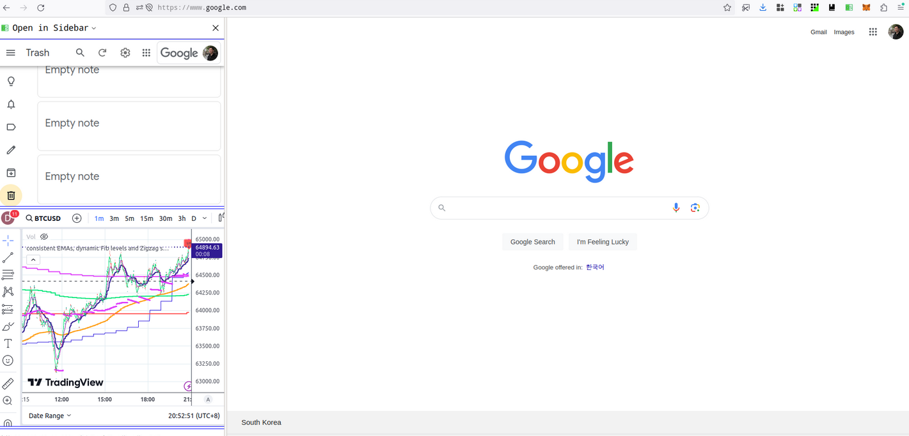

# Add default two sidebar web pages(https://keep.google.com, https://www.tradingview.com/chart)

You can modify sidebar/sidebar.html to support multiple sidebar web pages:

 
# Open in Sidebar
[日本語のREADME.mdを読みたい場合はここをクリックしてください](README_ja.md)

Very simple and useful extension. You can open a link in the sidebar.

# Installing
Go to [Open in Sidebar](https://addons.mozilla.org/en-US/firefox/addon/open_in_sidebar/) and Install this extension on Firefox.

# Usage
After installing the extension, you can watch a tutorial to open the sidebar.

# License
This project is licensed under Mozilla Public License Version 2.0 - see the [LICENSE.txt](LICENSE.txt) file for details.

# Cooperators
Illustration: miya
